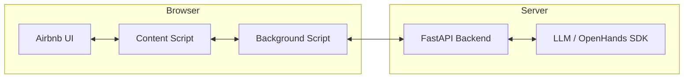
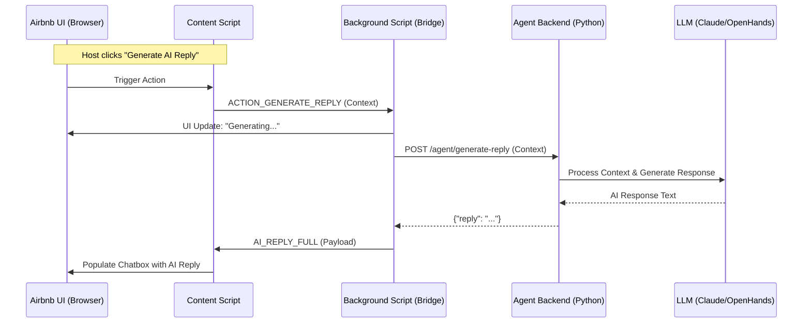
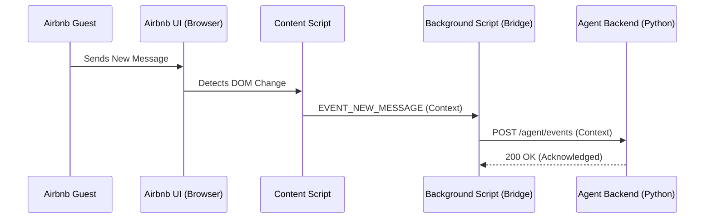

# Host Genie - Airbnb Host Assistant

Host Genie is an AI-powered Chrome extension designed to assist Airbnb hosts in managing their guest communications. It integrates directly into the Airbnb messaging interface, providing automated context syncing and AI-generated response suggestions.

## Project Structure

The project is divided into two main components:

- **`extension/`**: The Chrome extension that acts as the client and workflow controller.
- **`agent-backend-python/`**: The latest Python-based backend server that hosts the AI agent logic using the OpenHands SDK.
- **`backend/`**: (Legacy) An old JavaScript-based backend used for rapid testing. **Use `agent-backend-python` for the latest features.**

## Architecture: Server-Client Approach

Host Genie follows a **Client-Server** architecture where the Chrome Extension acts as the **Client (Controller)** and the Python Backend acts as the **Server (Agent)**.

### Implementation Details
- **Extension (Client)**: Responsible for DOM manipulation, detecting UI events (new messages, button clicks), and managing the overall workflow. It "pushes" context to the server and "pulls" generated replies.
- **Backend (Server)**: A stateless FastAPI server that receives context from the extension and uses an LLM (via OpenHands SDK) to generate professional host responses.

### Consequences of this Implementation
1. **Stateless Backend**: The server does not need to store user sessions or conversation history. All necessary context is provided by the extension in each request.
2. **Security**: Sensitive LLM API keys are stored securely on the backend server rather than being exposed in the extension's client-side code.
3. **Decoupling**: The backend can be scaled or updated independently of the extension. As long as the API contract is maintained, the agent logic can be swapped or improved without requiring an extension update.
4. **UI-Driven Workflow**: The extension has full control over when the agent is invoked, allowing for a seamless integration into the Airbnb host dashboard.

## Workflow & Information Flow

### 1. High-Level Architecture


### 2. Sequence Diagram: Generate AI Reply
This diagram illustrates the flow when a host requests an AI-generated response.



### 3. Sequence Diagram: Background Context Sync
The extension periodically syncs the conversation context to the backend to keep the agent "warm".



## Getting Started

### 1. Run the Backend
Navigate to the `agent-backend-python` directory and follow these steps:

1. **Install Dependencies**:
   ```bash
   cd agent-backend-python
   pip install -r requirements.txt
   ```
2. **Set Environment Variables**:
   Create a `.env` file or export the following variables:
   ```bash
   export LLM_API_KEY="your_api_key_here"
   export LLM_MODEL="anthropic/claude-3-5-sonnet-20240620" # Optional
   ```
3. **Start the Server**:
   ```bash
   python main.py
   ```
   The server will start on `http://localhost:3001`.

### 2. Enable the Extension
1. Open Google Chrome and navigate to `chrome://extensions/`.
2. Enable **Developer mode** (toggle in the top right).
3. Click **Load unpacked**.
4. Select the `extension/` folder from this project.
5. The Host Genie icon should now appear in your extensions bar.

## Usage
1. Log in to your Airbnb Host account.
2. Navigate to a guest message thread.
3. You will see Host Genie elements integrated into the chat interface.
4. Click **"Generate AI Reply"** to have the agent draft a response based on the current conversation context.
